# Application Architecture

## Method

### Architecture Overview

The application uses a Telegram Bot for natural-language transaction input and a Telegram Mini App for dashboard UX.

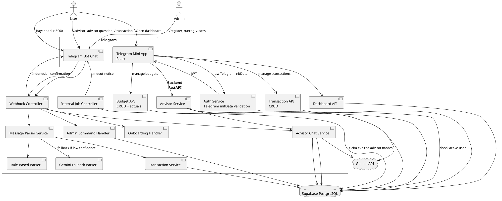

### External Documentation References

The AI coding agent should use these official references when implementing integrations:

- Telegram Mini Apps / Web Apps: https://core.telegram.org/bots/webapps
- Telegram Bot API: https://core.telegram.org/bots/api
- Telegram Webhooks: https://core.telegram.org/bots/webhooks
- FastAPI bigger applications and routers: https://fastapi.tiangolo.com/tutorial/bigger-applications/
- FastAPI settings: https://fastapi.tiangolo.com/advanced/settings/
- FastAPI Docker deployment: https://fastapi.tiangolo.com/deployment/docker/
- Supabase Python client: https://supabase.com/docs/reference/python/introduction
- Supabase Python select/pagination: https://supabase.com/docs/reference/python/select
- Gemini structured output: https://ai.google.dev/gemini-api/docs/structured-output
- Gemini API reference: https://ai.google.dev/api

Notes for implementers:
- Telegram Mini App `initData` must be validated on the backend.
- Do not trust frontend-only Telegram user data.
- Supabase service role key must stay server-side only.
- Gemini must be constrained with structured JSON schema and validated again by backend Pydantic models.

---

## System Context

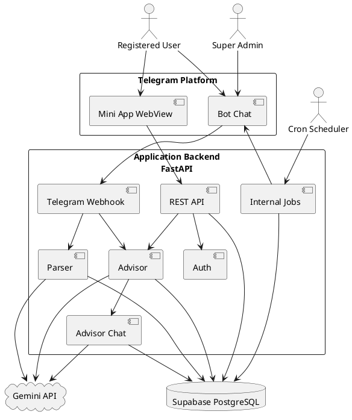

---

## Core Flows

### Flow 1: Admin Registers User

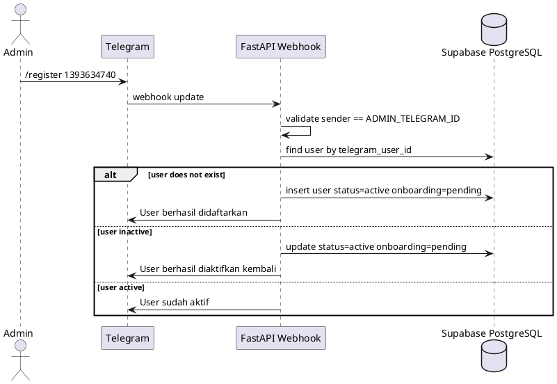

### Flow 2: Admin Unregisters User

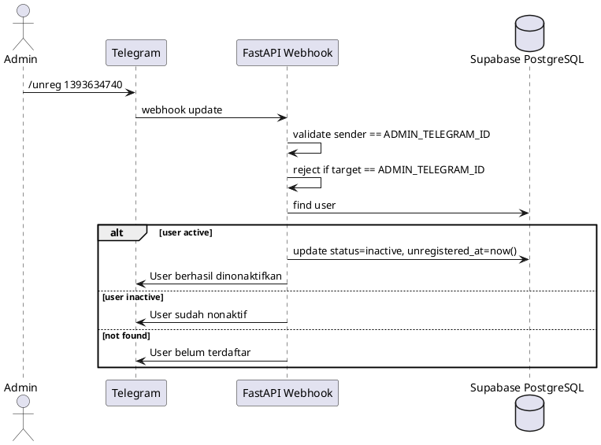

### Flow 3: Admin Lists Users

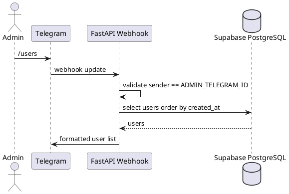

### Flow 4: Registered User Onboarding

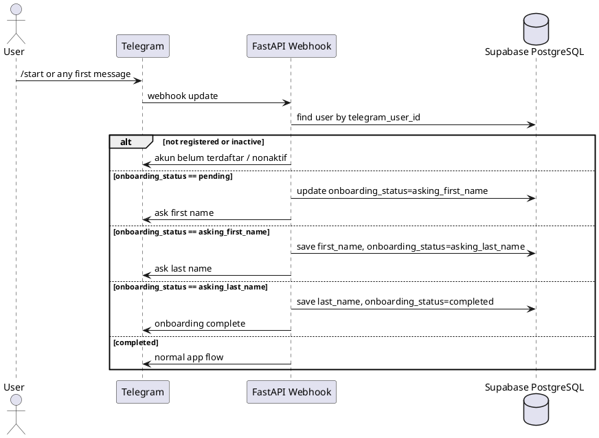

### Flow 5: User Records Expense

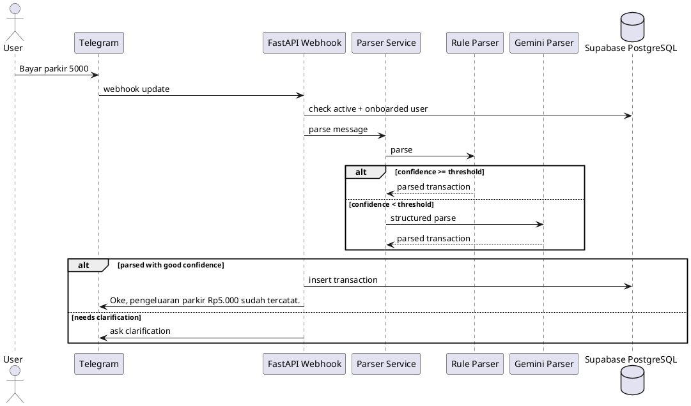

### Flow 6: Mini App Authentication

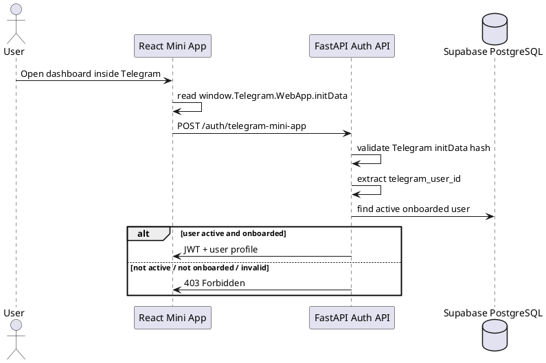

### Flow 7: Mini App Dashboard and Data Management

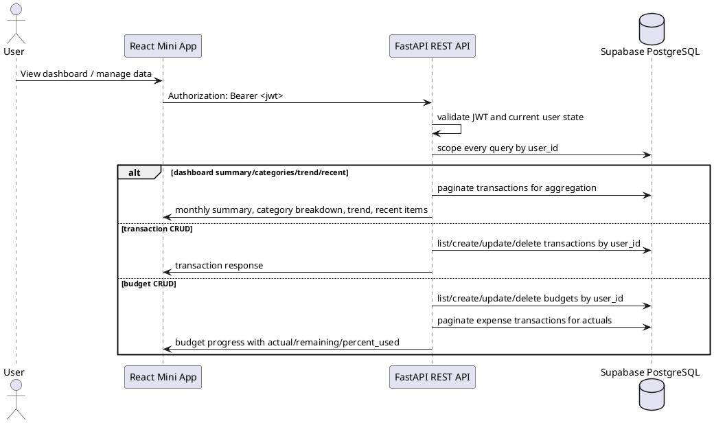

### Flow 8: Mini App Advisor Insights and Chat

```plantuml
@startuml
actor User
participant "React Mini App" as App
participant "Advisor API" as API
participant "Advisor Service" as Advisor
participant "Advisor Chat Service" as Chat
cloud "Gemini API" as Gemini
database "Supabase PostgreSQL" as DB

User -> App : Open insight panel / ask question
App -> API : POST /advisor/insights or /advisor/chat
API -> API : validate JWT and current user state

alt /advisor/insights
  API -> Advisor : build current-month context
  Advisor -> DB : paginate transactions and read budgets
  Advisor -> Gemini : structured monthly report request
  Gemini --> Advisor : summary, recommendations, warnings
  Advisor -> DB : insert advisor_insights
  API -> App : InsightsResponse
else /advisor/chat
  API -> Chat : answer advisor question
  Chat -> DB : read recent advisor_chat_messages
  Chat -> Advisor : build current-month context
  Advisor -> DB : paginate transactions and read budgets
  Chat -> Gemini : grounded chat prompt with context + history
  Gemini --> Chat : Indonesian answer
  Chat -> DB : insert user and assistant chat messages, source=mini_app
  API -> App : ChatResponse
end
@enduml
```

### Flow 9: Telegram Advisor Mode

```plantuml
@startuml
actor User
participant Telegram
participant "FastAPI Webhook" as API
participant "Advisor Mode Handler" as Mode
participant "Advisor Chat Service" as Chat
participant "Parser Service" as Parser
cloud "Gemini API" as Gemini
database "Supabase PostgreSQL" as DB

User -> Telegram : /advisor
Telegram -> API : webhook update
API -> DB : check active + onboarded user
API -> Mode : enter advisor mode
Mode -> DB : upsert conversation_states state=advisor_mode with chat_id + expires_at
API -> Telegram : Mode AI Advisor aktif

User -> Telegram : advisor question
Telegram -> API : webhook update
API -> DB : find latest advisor_mode state
alt advisor mode active
  API -> Chat : answer advisor question
  Chat -> DB : build context + read recent chat history
  Chat -> Gemini : grounded Indonesian advisor prompt
  Gemini --> Chat : answer
  Chat -> DB : insert user and assistant chat messages, source=telegram_chat
  Mode -> DB : refresh advisor_mode expires_at
  API -> Telegram : advisor answer
else advisor mode missing or expired
  API -> Parser : treat as normal transaction or show expiry message
end

User -> Telegram : /transaction
Telegram -> API : webhook update
API -> Mode : exit advisor mode
Mode -> DB : delete advisor_mode state
API -> Telegram : Mode transaksi aktif kembali
@enduml
```

### Flow 10: Advisor Mode Timeout Job

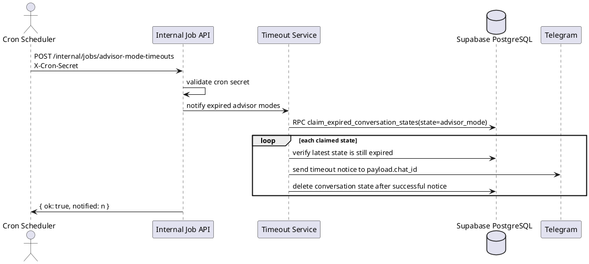

---

## Authorization Rules

### Bot Authorization Order

```text
1. Extract telegram_user_id from Telegram update.
2. If message is admin command:
   - /register <telegram_id>
   - /unreg <telegram_id>
   - /users
   Validate sender == ADMIN_TELEGRAM_ID.
3. For normal app usage:
   - find user by telegram_user_id.
4. If user not found or inactive:
   - reject.
5. If user active but onboarding_status != completed:
   - run onboarding flow.
6. If user active and onboarding completed:
   - `/advisor` enters advisor mode.
   - `/transaction` exits advisor mode.
   - messages inside active advisor mode go to advisor chat.
   - otherwise messages go to transaction parsing.
```

### Telegram Advisor Mode Order

```text
1. Completed user sends `/advisor`.
2. Backend creates or updates `conversation_states` with:
   - state = `advisor_mode`
   - payload.chat_id = Telegram chat ID
   - expires_at = now + ADVISOR_MODE_TIMEOUT_MINUTES
3. Subsequent non-command messages are answered by Advisor Chat Service.
4. Advisor Chat Service stores both user and assistant messages in `advisor_chat_messages`.
5. Each successful advisor answer refreshes advisor mode expiry.
6. User sends `/transaction` to delete the advisor mode state and return to transaction mode.
7. Expired advisor mode is deleted and user is asked to resend the transaction if needed.
```

### Mini App Authorization Order

```text
1. Frontend reads raw Telegram initData.
2. Frontend sends raw initData to backend.
3. Backend validates initData using bot token.
4. Backend extracts Telegram user ID.
5. Backend checks users table.
6. Backend rejects if user is missing, inactive, or onboarding incomplete.
7. Backend returns JWT if authorized.
8. Frontend sends JWT on subsequent API calls.
9. Protected APIs reject missing/invalid JWT with 401 and inactive/pending users with 403.
```

### Internal Job Authorization Order

```text
1. Cron scheduler calls internal endpoint.
2. Backend requires `X-Cron-Secret` header.
3. Backend compares the header with `CRON_SECRET` using constant-time comparison.
4. Missing, wrong, or unset secret returns 401.
5. Authorized jobs may use service-role Supabase access through repositories/RPCs.
```

---

## API Surface

### FastAPI Routers

| Prefix | Router | Purpose | Auth |
|---|---|---|---|
| `/health` | `app.api.routes.health` | Health check | Public |
| `/auth` | `app.api.routes.auth` | Telegram Mini App login and current user profile | Login public, `/me` JWT |
| `/transactions` | `app.api.routes.transactions` | User-scoped transaction list/create/update/delete | JWT |
| `/dashboard` | `app.api.routes.dashboard` | Summary, category breakdown, trend, recent transactions | JWT |
| `/budgets` | `app.api.routes.budgets` | User-scoped budget list/create/update/delete with actual expenses | JWT |
| `/advisor` | `app.api.routes.advisor` | Monthly insights and advisor chat | JWT |
| `/internal` | `app.api.routes.internal` | Scheduled/internal maintenance jobs | `X-Cron-Secret` |
| `/webhooks` | `app.bot.webhook` | Telegram Bot webhook | Telegram webhook payload + in-app authorization |

### Current Endpoints

```text
GET    /health
POST   /auth/telegram-mini-app
GET    /auth/me
GET    /transactions
POST   /transactions
PATCH  /transactions/{transaction_id}
DELETE /transactions/{transaction_id}
GET    /dashboard/summary
GET    /dashboard/categories
GET    /dashboard/trend
GET    /dashboard/recent-transactions
GET    /budgets?month=YYYY-MM
POST   /budgets
PATCH  /budgets/{budget_id}
DELETE /budgets/{budget_id}
POST   /advisor/insights
POST   /advisor/chat
POST   /internal/jobs/advisor-mode-timeouts
POST   /webhooks/telegram
```

---

## Code Architecture

### Backend Module Map

```text
app/main.py                        FastAPI app, CORS, router registration
app/api/dependencies.py            Dependency factories and JWT current-user guard
app/api/routes/*.py                REST API route handlers
app/bot/webhook.py                 Telegram webhook entrypoint + BackgroundTasks
app/bot/commands.py                Admin command handling
app/bot/onboarding.py              User access/onboarding dispatch
app/bot/transactions.py            Bot transaction parsing + persistence
app/bot/advisor.py                 Telegram advisor mode state machine
app/repositories/*.py              Supabase query-builder repositories
app/services/rule_parser.py        Deterministic Indonesian transaction parser
app/services/gemini_parser.py      Gemini fallback transaction parser
app/services/advisor_service.py    Advisor context aggregation + Gemini prompts
app/services/advisor_chat_service.py Shared advisor chat persistence/orchestration
app/services/advisor_mode_timeout_service.py Expired advisor mode notifications
app/core/*.py                      Settings and Telegram initData validation
app/integrations/*.py              Supabase and Telegram HTTP clients
```

Notes:
- Diagrams use logical components such as "Transaction Service" and "Dashboard API". In code, some logic currently lives directly in route or bot modules rather than separate service classes.
- All protected user data access must be scoped by `user_id`.
- Long-running Telegram update handling is delegated via FastAPI `BackgroundTasks`; the webhook returns `{ "ok": true }` quickly.

### Frontend Module Map

```text
src/App.tsx                        Telegram auth bootstrap and dashboard shell
src/api/*.ts                       Typed Axios API helpers
src/components/DashboardOverview.tsx Summary, categories, trend, recent transactions
src/components/BudgetPanel.tsx     Budget CRUD and progress display
src/components/InsightPanel.tsx    Advisor insights and chat UI
src/components/TransactionsPanel.tsx Transaction CRUD UI
src/utils/currency.ts              IDR formatting helper
src/styles.css                     Global plain CSS styling
```

---

## Data Model

### Entity Relationship Diagram

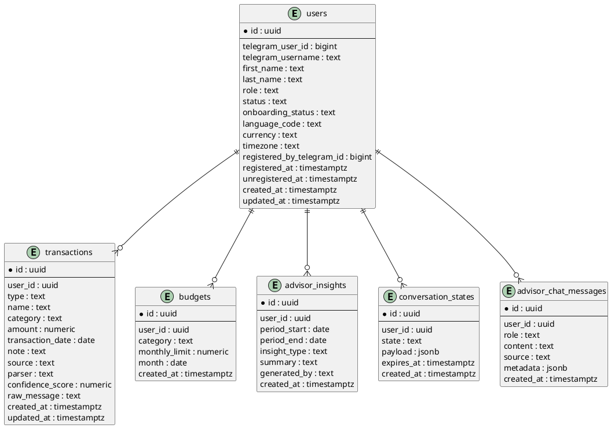

### Constraints and Enums

```text
users.telegram_user_id unique not null
users.role in ('admin', 'user')
users.status in ('active', 'inactive')
users.onboarding_status in ('pending', 'asking_first_name', 'asking_last_name', 'completed')

transactions.type in ('income', 'expense')
transactions.amount > 0
transactions.parser in ('rule_based', 'gemini', 'manual')
transactions.source is used as 'telegram_chat' for bot and 'manual' for Mini App

budgets.monthly_limit > 0
budgets unique(user_id, category, month)

advisor_chat_messages.role in ('user', 'assistant')
advisor_chat_messages.source in ('telegram_chat', 'mini_app')
```

Application-level transaction categories are fixed in Pydantic schemas and UI types:

```text
transportasi, makanan_minuman, tagihan, tempat_tinggal, belanja,
hiburan, utang_cicilan, pendapatan, kesehatan, pendidikan, keluarga, lainnya
```

### Indexes, Triggers, and RPCs

```text
idx_users_telegram_user_id                      users(telegram_user_id)
idx_users_status                                users(status)
idx_users_onboarding_status                     users(onboarding_status)
idx_transactions_user_date                      transactions(user_id, transaction_date desc)
idx_transactions_user_category                  transactions(user_id, category)
idx_budgets_user_month                          budgets(user_id, month)
idx_conversation_states_user_expires            conversation_states(user_id, expires_at)
idx_advisor_chat_messages_user_created_at       advisor_chat_messages(user_id, created_at desc)
```

`set_updated_at()` trigger maintains `updated_at` for:

```text
users
transactions
```

`claim_expired_conversation_states(p_state, p_limit, p_claim_timeout_seconds)` is a Supabase RPC used by the internal advisor-mode timeout job. It claims expired states with `for update skip locked` and stores `payload.timeout_claimed_at` to reduce duplicate timeout notifications across concurrent job runs.

---
