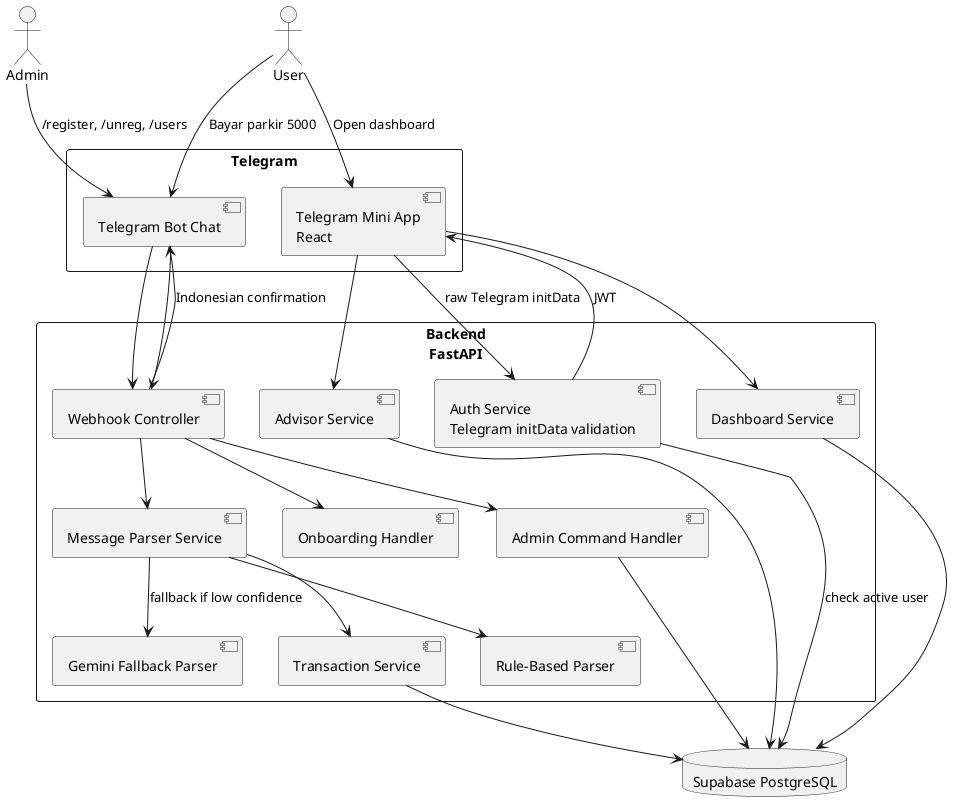
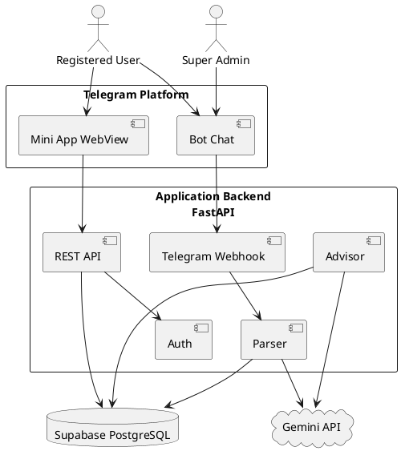
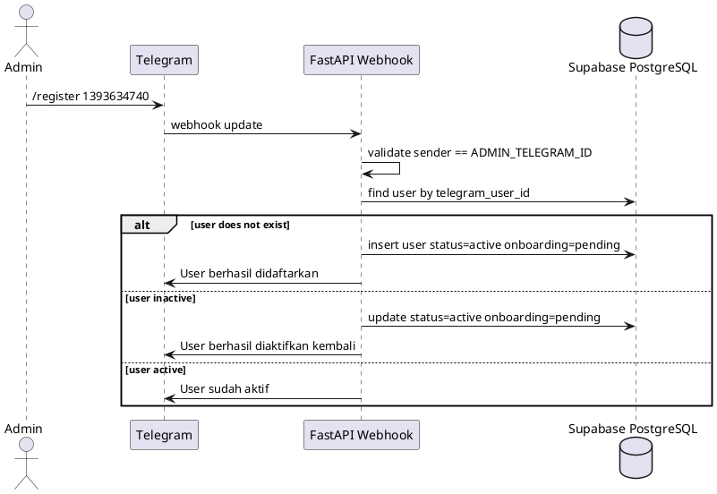
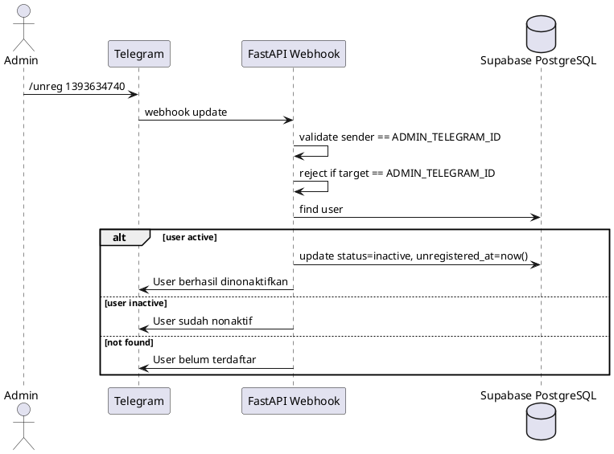
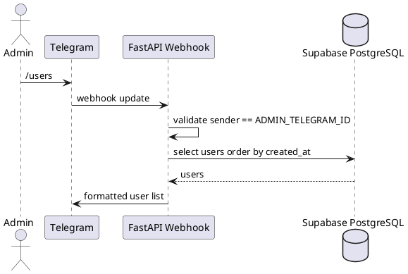
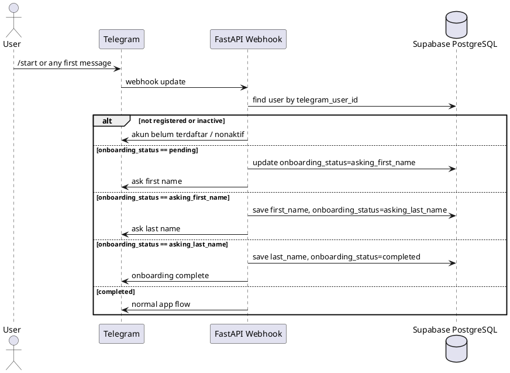
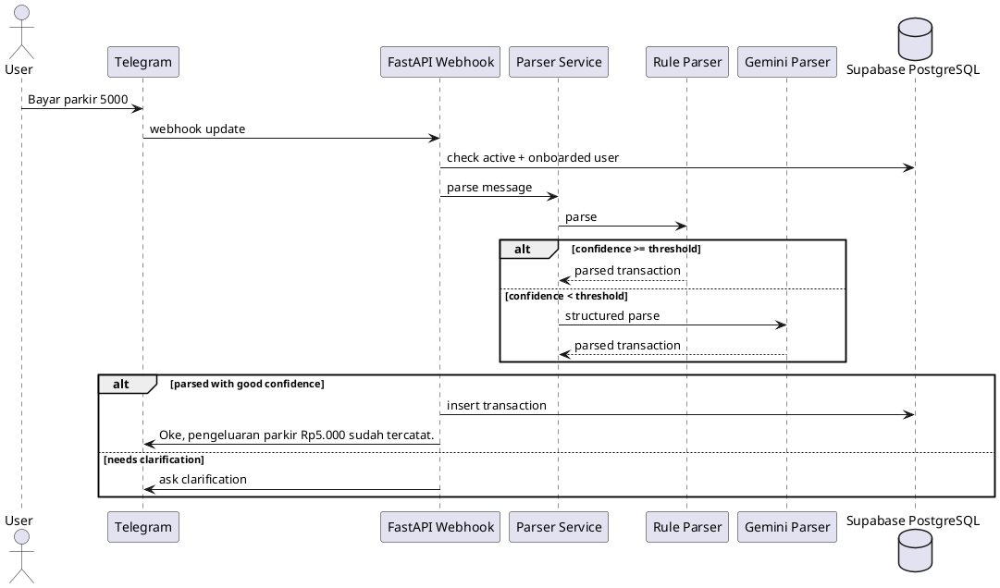
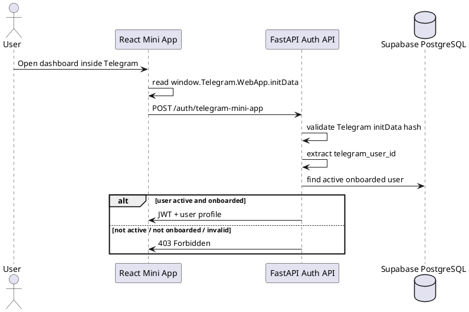
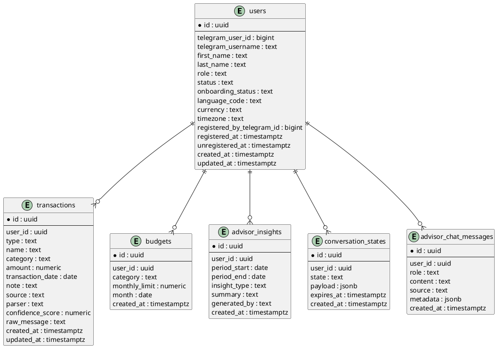

# Application Architecture

## Method

### Architecture Overview

The application uses a Telegram Bot for natural-language transaction input and a Telegram Mini App for dashboard UX.



### External Documentation References

The AI coding agent should use these official references when implementing integrations:

- Telegram Mini Apps / Web Apps: https://core.telegram.org/bots/webapps
- Telegram Bot API: https://core.telegram.org/bots/api
- Telegram Webhooks: https://core.telegram.org/bots/webhooks
- FastAPI bigger applications and routers: https://fastapi.tiangolo.com/tutorial/bigger-applications/
- FastAPI settings: https://fastapi.tiangolo.com/advanced/settings/
- FastAPI Docker deployment: https://fastapi.tiangolo.com/deployment/docker/
- Supabase Python client: https://supabase.com/docs/reference/python/introduction
- Supabase Python select/pagination: https://supabase.com/docs/reference/python/select
- Gemini structured output: https://ai.google.dev/gemini-api/docs/structured-output
- Gemini API reference: https://ai.google.dev/api

Notes for implementers:
- Telegram Mini App `initData` must be validated on the backend.
- Do not trust frontend-only Telegram user data.
- Supabase service role key must stay server-side only.
- Gemini must be constrained with structured JSON schema and validated again by backend Pydantic models.

---

## System Context



---

## Core Flows

### Flow 1: Admin Registers User



### Flow 2: Admin Unregisters User



### Flow 3: Admin Lists Users



### Flow 4: Registered User Onboarding



### Flow 5: User Records Expense



### Flow 6: Mini App Authentication



---

## Authorization Rules

### Bot Authorization Order

```text
1. Extract telegram_user_id from Telegram update.
2. If message is admin command:
   - /register <telegram_id>
   - /unreg <telegram_id>
   - /users
   Validate sender == ADMIN_TELEGRAM_ID.
3. For normal app usage:
   - find user by telegram_user_id.
4. If user not found or inactive:
   - reject.
5. If user active but onboarding_status != completed:
   - run onboarding flow.
6. If user active and onboarding completed:
   - continue to parser, transaction, advisor, or bot menu flow.
```

### Mini App Authorization Order

```text
1. Frontend reads raw Telegram initData.
2. Frontend sends raw initData to backend.
3. Backend validates initData using bot token.
4. Backend extracts Telegram user ID.
5. Backend checks users table.
6. Backend rejects if user is missing, inactive, or onboarding incomplete.
7. Backend returns JWT if authorized.
8. Frontend sends JWT on subsequent API calls.
```

---

## Data Model

### Entity Relationship Diagram



---