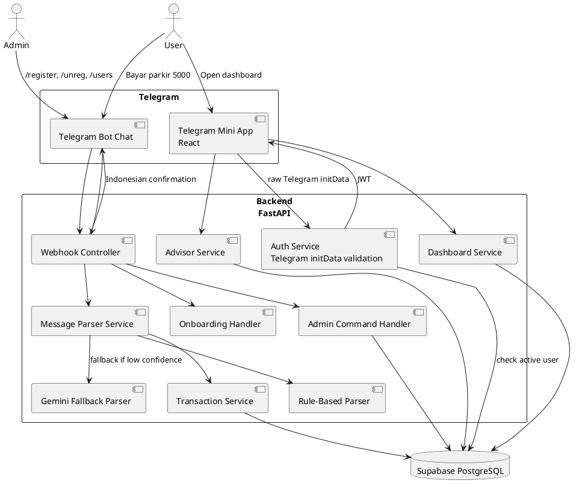
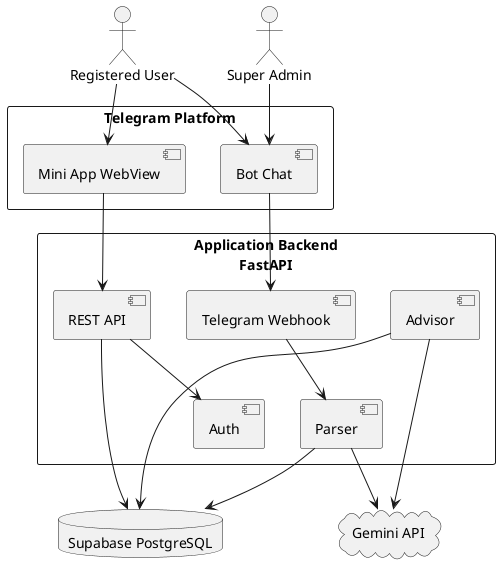
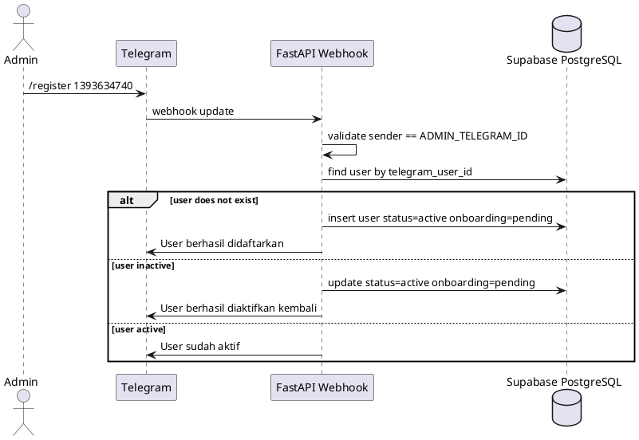
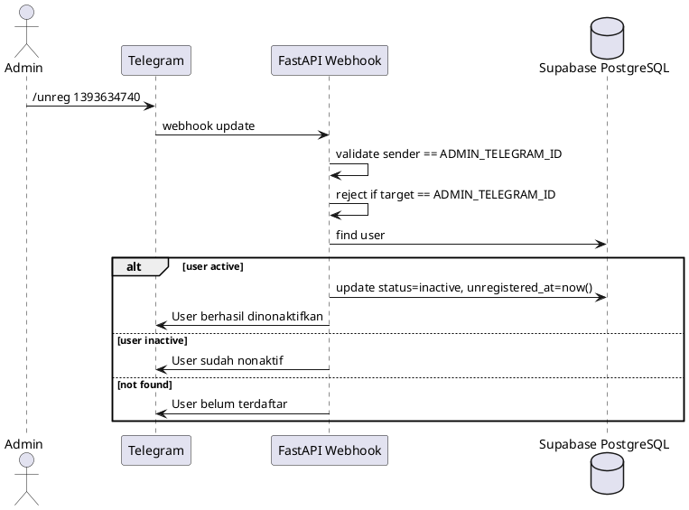
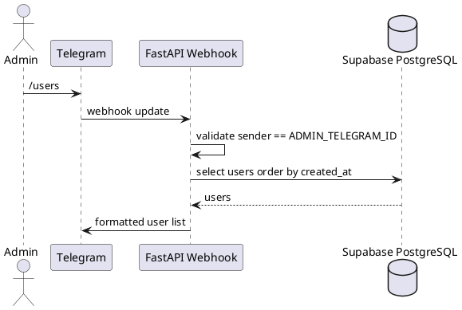
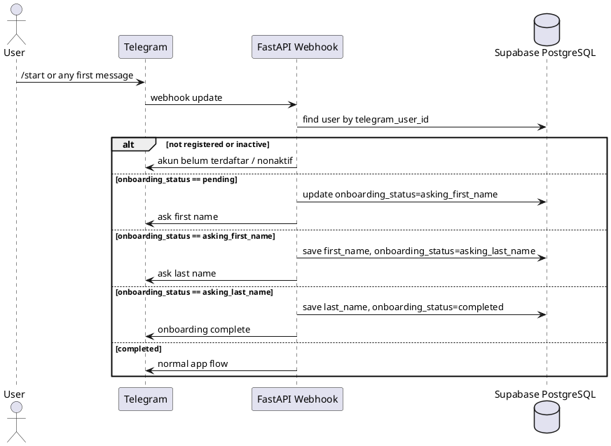
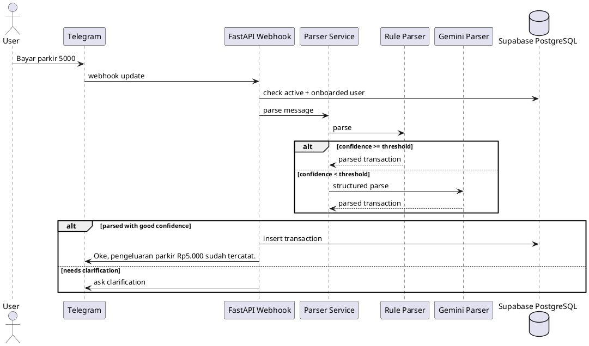
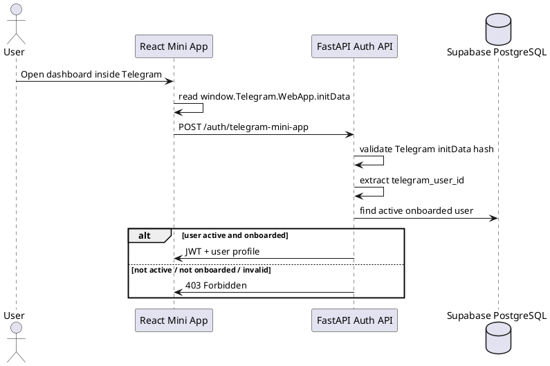
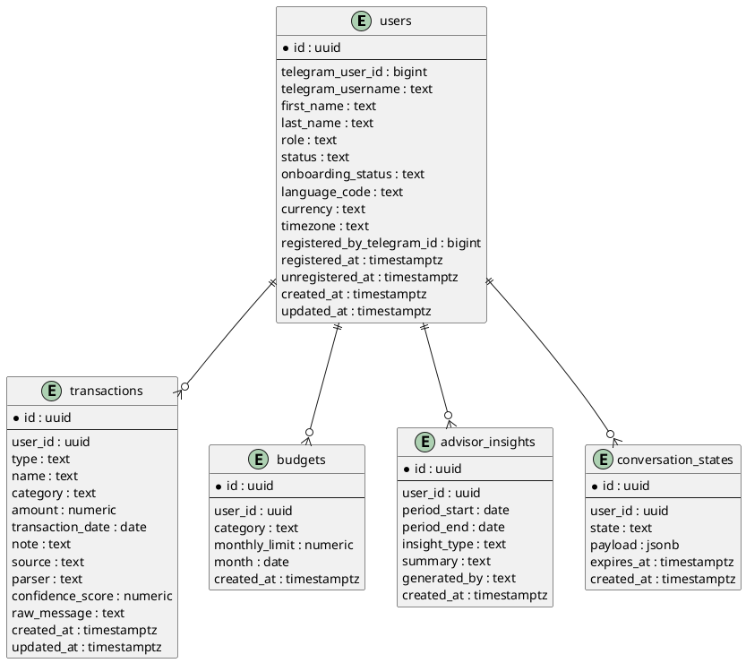

# SPEC-1-AI Telegram Expense Tracker & Financial Advisor

**Document status:** MVP architecture and implementation specification  
**Primary implementers:** Human contractors + AI agentic coding tools  
**Target platform:** Telegram Bot + Telegram Mini App  
**Backend:** Python FastAPI  
**Database:** Supabase PostgreSQL  
**Frontend:** React Telegram Mini App  
**AI fallback parser:** Gemini API structured output  
**Language:** Indonesian only  
**Timezone:** Asia/Jakarta  
**Currency:** IDR  

---

## Background

Users often fail to track expenses because manual entry is tedious. This application reduces friction by allowing users to record financial transactions by chatting with a Telegram bot in Indonesian natural language.

Example:

```text
User: Bayar parkir 5000
Bot: Oke, pengeluaran parkir Rp5.000 sudah tercatat.
```

The backend parses the message into structured data:

```json
{
  "name": "Parkir",
  "amount": 5000,
  "type": "expense",
  "category": "transportasi"
}
```

The user can also open a full dashboard inside Telegram using a Telegram Mini App. The dashboard shows cashflow summaries, category breakdowns, monthly trends, recent transactions, budgets, and AI-generated budgeting/cashflow insights.

The app is private by default. Users cannot self-register. One super admin, configured through `ADMIN_TELEGRAM_ID`, controls access via Telegram commands.

---

## Key Product Decisions

| Area | Decision |
|---|---|
| User interface | Telegram Bot for chat input + React Mini App for dashboard |
| Backend | Python FastAPI |
| Database | Supabase PostgreSQL |
| User identity | Telegram user ID |
| User registration | Super admin allowlist |
| Admin identity | `ADMIN_TELEGRAM_ID` environment variable |
| Parser strategy | Rule-based parser first, Gemini fallback |
| Advisor scope | Budgeting and cashflow advice |
| Limited advisor support | Debt payoff and savings goal projections based on user history |
| Language | Indonesian only |
| Currency | IDR |
| MVP access model | Private multi-user app |
| Excluded advice | Investment, insurance, tax, crypto, stock, loan product recommendations |

---

## Requirements

### Must Have

#### Access Control

- System supports multiple authenticated users.
- Each user is identified by `telegram_user_id`.
- Users cannot self-register.
- Only one super admin can register, unregister, and list users.
- Super admin Telegram ID is configured in backend env:

```env
ADMIN_TELEGRAM_ID=1393634740
```

- Admin can register user:

```text
/register 1393634740
```

- Admin can deactivate user:

```text
/unreg 1393634740
```

- Admin can list users:

```text
/users
```

- Non-admin users cannot use `/register`, `/unreg`, or `/users`.
- Unregistered users cannot use the bot or Mini App.
- Inactive users keep historical data but cannot access app features.
- Admin cannot be unregistered.

#### User Onboarding

- When a registered active user first chats with the bot, the bot asks for first name.
- After first name is saved, the bot asks for last name.
- User cannot record transactions until onboarding is complete.
- First name and last name are stored in `users`.
- Bot responses are in Indonesian only.

Example onboarding:

```text
User: /start

Bot: Halo! Akun kamu sudah terdaftar. Sebelum mulai, boleh isi nama depan kamu?

User: Budi

Bot: Terima kasih. Sekarang isi nama belakang kamu.

User: Santoso

Bot: Oke Budi, profil kamu sudah lengkap.
Sekarang kamu bisa mencatat pemasukan dan pengeluaran.
Contoh: Bayar parkir 5000
```

#### Expense and Income Tracking

- User can record income and expenses through Telegram chat using Indonesian natural language.
- Bot parses messages into:
  - `name`
  - `amount`
  - `type`
  - `category`
  - `transaction_date`
  - `confidence_score`
  - `parser`
- Supported transaction types:
  - `income`
  - `expense`
- Bot asks clarification when parsing confidence is low.
- Backend stores each transaction in Supabase PostgreSQL.
- User can create, edit, delete, and list transactions from Mini App.
- User can only access their own data.

#### Dashboard Mini App

- User can open a Telegram Mini App dashboard from the bot.
- Mini App authenticates with Telegram `initData`.
- Backend validates Telegram `initData` server-side before issuing app JWT.
- Mini App checks that user is registered, active, and onboarded.
- Dashboard shows:
  - monthly income
  - monthly expenses
  - net cashflow
  - spending by category
  - recent transactions
  - monthly trend
  - budget progress
  - AI insight card

#### AI Advisor

- Advisor gives budgeting and cashflow advice based on historical user data.
- Advisor can answer limited debt payoff questions only as projections from the user's financial history.
- Advisor can answer savings goal questions only as projections from the user's financial history.
- Advisor must avoid:
  - investment advice
  - crypto advice
  - stock recommendations
  - insurance recommendations
  - tax filing advice
  - loan product recommendations
- Advisor responses must be in Indonesian.

### Should Have

- User can set monthly budget limits by category.
- System can detect recurring expenses.
- User can ask questions like:
  - `Pengeluaran makan bulan ini berapa?`
  - `Cashflow saya sehat atau tidak?`
  - `Kategori mana yang paling boros?`
  - `Bisa bantu saya menabung 2 juta per bulan?`
  - `Kalau saya punya utang 5 juta, kira-kira bisa lunas kapan?`
- System can categorize common Indonesian expense terms:
  - parkir
  - bensin
  - makan
  - kopi
  - listrik
  - kos
  - cicilan
  - transportasi
  - belanja
  - hiburan

### Could Have

- Receipt image parsing.
- CSV export.
- Google Sheets export.
- Shared household wallet.
- Multiple wallets, such as cash, bank, and e-wallet.
- Reminder notifications for budgets or recurring expenses.

### Won't Have in MVP

- Bank or e-wallet auto-sync.
- Investment recommendations.
- Crypto, stock, insurance, tax, or loan product advice.
- Full accounting ledger.
- Multi-language support.
- Multi-currency support.
- Tax filing.
- Product recommendations for loans, investments, or insurance.

---

## Method

### Architecture Overview

The application uses a Telegram Bot for natural-language transaction input and a Telegram Mini App for dashboard UX.



### External Documentation References

The AI coding agent should use these official references when implementing integrations:

- Telegram Mini Apps / Web Apps: https://core.telegram.org/bots/webapps
- Telegram Bot API: https://core.telegram.org/bots/api
- Telegram Webhooks: https://core.telegram.org/bots/webhooks
- FastAPI bigger applications and routers: https://fastapi.tiangolo.com/tutorial/bigger-applications/
- FastAPI settings: https://fastapi.tiangolo.com/advanced/settings/
- FastAPI Docker deployment: https://fastapi.tiangolo.com/deployment/docker/
- Supabase Python client: https://supabase.com/docs/reference/python/introduction
- Supabase Python select/pagination: https://supabase.com/docs/reference/python/select
- Gemini structured output: https://ai.google.dev/gemini-api/docs/structured-output
- Gemini API reference: https://ai.google.dev/api

Notes for implementers:
- Telegram Mini App `initData` must be validated on the backend.
- Do not trust frontend-only Telegram user data.
- Supabase service role key must stay server-side only.
- Gemini must be constrained with structured JSON schema and validated again by backend Pydantic models.

---

## System Context



---

## Core Flows

### Flow 1: Admin Registers User



### Flow 2: Admin Unregisters User



### Flow 3: Admin Lists Users



### Flow 4: Registered User Onboarding



### Flow 5: User Records Expense



### Flow 6: Mini App Authentication



---

## Authorization Rules

### Bot Authorization Order

```text
1. Extract telegram_user_id from Telegram update.
2. If message is admin command:
   - /register <telegram_id>
   - /unreg <telegram_id>
   - /users
   Validate sender == ADMIN_TELEGRAM_ID.
3. For normal app usage:
   - find user by telegram_user_id.
4. If user not found or inactive:
   - reject.
5. If user active but onboarding_status != completed:
   - run onboarding flow.
6. If user active and onboarding completed:
   - continue to parser, transaction, advisor, or bot menu flow.
```

### Mini App Authorization Order

```text
1. Frontend reads raw Telegram initData.
2. Frontend sends raw initData to backend.
3. Backend validates initData using bot token.
4. Backend extracts Telegram user ID.
5. Backend checks users table.
6. Backend rejects if user is missing, inactive, or onboarding incomplete.
7. Backend returns JWT if authorized.
8. Frontend sends JWT on subsequent API calls.
```

---

## Data Model

### Entity Relationship Diagram



---

## Supabase PostgreSQL Schema

### Migration: `001_create_users.sql`

```sql
create table if not exists users (
  id uuid primary key default gen_random_uuid(),

  telegram_user_id bigint unique not null,
  telegram_username text,
  first_name text,
  last_name text,

  role text not null default 'user'
    check (role in ('admin', 'user')),

  status text not null default 'active'
    check (status in ('active', 'inactive')),

  onboarding_status text not null default 'pending'
    check (
      onboarding_status in (
        'pending',
        'asking_first_name',
        'asking_last_name',
        'completed'
      )
    ),

  language_code text default 'id',
  currency text default 'IDR',
  timezone text default 'Asia/Jakarta',

  registered_by_telegram_id bigint,
  registered_at timestamptz,
  unregistered_at timestamptz,

  created_at timestamptz not null default now(),
  updated_at timestamptz not null default now()
);
```

### Migration: `002_create_transactions.sql`

```sql
create table if not exists transactions (
  id uuid primary key default gen_random_uuid(),

  user_id uuid not null references users(id) on delete cascade,

  type text not null check (type in ('income', 'expense')),
  name text not null,
  category text not null,
  amount numeric(14, 2) not null check (amount > 0),
  transaction_date date not null,

  note text,
  source text not null default 'telegram_chat',
  parser text not null check (parser in ('rule_based', 'gemini', 'manual')),
  confidence_score numeric(4, 3),
  raw_message text,

  created_at timestamptz not null default now(),
  updated_at timestamptz not null default now()
);
```

### Migration: `003_create_budgets.sql`

```sql
create table if not exists budgets (
  id uuid primary key default gen_random_uuid(),

  user_id uuid not null references users(id) on delete cascade,
  category text not null,
  monthly_limit numeric(14, 2) not null check (monthly_limit > 0),
  month date not null,

  created_at timestamptz not null default now(),

  unique(user_id, category, month)
);
```

### Migration: `004_create_advisor_insights.sql`

```sql
create table if not exists advisor_insights (
  id uuid primary key default gen_random_uuid(),

  user_id uuid not null references users(id) on delete cascade,
  period_start date not null,
  period_end date not null,

  insight_type text not null,
  summary text not null,
  generated_by text not null default 'gemini',

  created_at timestamptz not null default now()
);
```

### Migration: `005_create_conversation_states.sql`

```sql
create table if not exists conversation_states (
  id uuid primary key default gen_random_uuid(),

  user_id uuid not null references users(id) on delete cascade,
  state text not null,
  payload jsonb not null default '{}',
  expires_at timestamptz not null,

  created_at timestamptz not null default now()
);
```

### Migration: `006_create_indexes.sql`

```sql
create index if not exists idx_users_telegram_user_id
on users(telegram_user_id);

create index if not exists idx_users_status
on users(status);

create index if not exists idx_users_onboarding_status
on users(onboarding_status);

create index if not exists idx_transactions_user_date
on transactions(user_id, transaction_date desc);

create index if not exists idx_transactions_user_category
on transactions(user_id, category);

create index if not exists idx_budgets_user_month
on budgets(user_id, month);

create index if not exists idx_conversation_states_user_expires
on conversation_states(user_id, expires_at);
```

### Migration: `007_updated_at_triggers.sql`

```sql
create or replace function set_updated_at()
returns trigger as $$
begin
  new.updated_at = now();
  return new;
end;
$$ language plpgsql;

drop trigger if exists set_users_updated_at on users;
create trigger set_users_updated_at
before update on users
for each row execute function set_updated_at();

drop trigger if exists set_transactions_updated_at on transactions;
create trigger set_transactions_updated_at
before update on transactions
for each row execute function set_updated_at();
```

---

## Transaction Categories

Use fixed category enum values in application code.

```python
TRANSACTION_CATEGORIES = [
    "transportasi",
    "makanan_minuman",
    "tagihan",
    "tempat_tinggal",
    "belanja",
    "hiburan",
    "utang_cicilan",
    "pendapatan",
    "kesehatan",
    "pendidikan",
    "keluarga",
    "lainnya",
]
```

Initial keyword mapping:

```python
CATEGORY_KEYWORDS = {
    "transportasi": [
        "parkir", "bensin", "grab", "gojek", "tol", "ojek", "taksi",
        "angkot", "bus", "kereta", "mrt", "lrt"
    ],
    "makanan_minuman": [
        "makan", "kopi", "restoran", "nasi", "minum", "jajan",
        "sarapan", "siang", "malam", "bakso", "mie", "ayam"
    ],
    "tagihan": [
        "listrik", "air", "internet", "pulsa", "token", "wifi",
        "pdam", "pln"
    ],
    "tempat_tinggal": [
        "kos", "kontrakan", "sewa", "apartemen", "rumah"
    ],
    "belanja": [
        "belanja", "supermarket", "alfamart", "indomaret",
        "tokopedia", "shopee", "lazada"
    ],
    "hiburan": [
        "bioskop", "netflix", "spotify", "game", "konser",
        "liburan"
    ],
    "utang_cicilan": [
        "cicilan", "utang", "pinjaman", "bayar utang"
    ],
    "pendapatan": [
        "gaji", "bonus", "freelance", "transfer masuk",
        "pendapatan"
    ],
    "kesehatan": [
        "dokter", "obat", "apotek", "rumah sakit", "klinik"
    ],
    "pendidikan": [
        "sekolah", "kursus", "buku", "kuliah", "training"
    ],
    "keluarga": [
        "anak", "istri", "suami", "orang tua", "keluarga"
    ],
}
```

---

## API Specification

All protected APIs use:

```http
Authorization: Bearer <jwt>
```

### Health

#### `GET /health`

Response:

```json
{
  "status": "ok"
}
```

---

### Telegram Webhook

#### `POST /webhooks/telegram`

Used by Telegram webhook.

Notes:
- Must return `{"ok": true}` quickly.
- Must not expose error stack traces.
- Must be idempotent where possible.
- Telegram retries can cause duplicate updates, so implementation should consider `update_id` deduplication in a future version.

---

### Mini App Auth

#### `POST /auth/telegram-mini-app`

Request:

```json
{
  "init_data": "query_id=...&user=...&auth_date=...&hash=..."
}
```

Success response:

```json
{
  "access_token": "jwt",
  "token_type": "bearer",
  "user": {
    "id": "uuid",
    "telegram_user_id": 1393634740,
    "first_name": "Budi",
    "last_name": "Santoso",
    "role": "user",
    "status": "active",
    "currency": "IDR",
    "timezone": "Asia/Jakarta"
  }
}
```

Error responses:

```json
{
  "detail": "Data Telegram tidak valid."
}
```

```json
{
  "detail": "Akun kamu belum terdaftar atau sudah dinonaktifkan."
}
```

```json
{
  "detail": "Selesaikan onboarding lewat bot terlebih dahulu."
}
```

---

### Transactions

#### `GET /transactions`

Query params:

| Param | Type | Required | Example |
|---|---:|---:|---|
| `month` | string | no | `2026-06` |
| `type` | string | no | `expense` |
| `category` | string | no | `transportasi` |
| `limit` | int | no | `50` |
| `offset` | int | no | `0` |

Response:

```json
{
  "items": [
    {
      "id": "uuid",
      "type": "expense",
      "name": "Parkir",
      "category": "transportasi",
      "amount": 5000,
      "transaction_date": "2026-06-26",
      "note": null,
      "source": "telegram_chat",
      "parser": "rule_based",
      "confidence_score": 0.92
    }
  ],
  "limit": 50,
  "offset": 0
}
```

#### `POST /transactions`

Request:

```json
{
  "type": "expense",
  "name": "Parkir",
  "category": "transportasi",
  "amount": 5000,
  "transaction_date": "2026-06-26",
  "note": "Parkir kantor"
}
```

Response:

```json
{
  "id": "uuid",
  "type": "expense",
  "name": "Parkir",
  "category": "transportasi",
  "amount": 5000,
  "transaction_date": "2026-06-26",
  "note": "Parkir kantor",
  "source": "manual",
  "parser": "manual"
}
```

#### `PATCH /transactions/{transaction_id}`

Request:

```json
{
  "name": "Parkir kantor",
  "amount": 7000,
  "category": "transportasi"
}
```

Response: updated transaction.

#### `DELETE /transactions/{transaction_id}`

MVP behavior: hard delete.

Response:

```json
{
  "deleted": true
}
```

---

### Budgets

#### `GET /budgets?month=2026-06`

Response:

```json
{
  "items": [
    {
      "id": "uuid",
      "category": "makanan_minuman",
      "monthly_limit": 1500000,
      "month": "2026-06-01",
      "actual": 1200000,
      "remaining": 300000,
      "percent_used": 80
    }
  ]
}
```

#### `POST /budgets`

Request:

```json
{
  "category": "makanan_minuman",
  "monthly_limit": 1500000,
  "month": "2026-06-01"
}
```

#### `PATCH /budgets/{budget_id}`

Request:

```json
{
  "monthly_limit": 1800000
}
```

#### `DELETE /budgets/{budget_id}`

Response:

```json
{
  "deleted": true
}
```

---

### Dashboard

#### `GET /dashboard/summary?month=2026-06`

Response:

```json
{
  "month": "2026-06",
  "income_total": 8000000,
  "expense_total": 6200000,
  "net_cashflow": 1800000,
  "savings_rate_percent": 22.5
}
```

#### `GET /dashboard/categories?month=2026-06`

Response:

```json
{
  "items": [
    {
      "category": "makanan_minuman",
      "amount": 2100000,
      "percent": 33.87
    },
    {
      "category": "transportasi",
      "amount": 900000,
      "percent": 14.52
    }
  ]
}
```

#### `GET /dashboard/trend?months=6`

Response:

```json
{
  "items": [
    {
      "month": "2026-01",
      "income_total": 7500000,
      "expense_total": 6100000,
      "net_cashflow": 1400000
    }
  ]
}
```

#### `GET /dashboard/recent-transactions?limit=10`

Response:

```json
{
  "items": [
    {
      "id": "uuid",
      "type": "expense",
      "name": "Parkir",
      "amount": 5000,
      "category": "transportasi",
      "transaction_date": "2026-06-26"
    }
  ]
}
```

---

### Advisor

#### `POST /advisor/insights`

Request:

```json
{
  "month": "2026-06"
}
```

Response:

```json
{
  "summary": "Bulan ini cashflow kamu positif Rp1.800.000. Pengeluaran makanan dan minuman paling besar...",
  "recommendations": [
    "Batasi pengeluaran makanan dan minuman menjadi sekitar Rp50.000 per hari.",
    "Pertahankan pengeluaran transportasi karena masih stabil dibanding bulan lalu."
  ],
  "warnings": [
    "Kategori makanan dan minuman sudah melewati budget sebesar Rp600.000."
  ]
}
```

#### `POST /advisor/chat`

Request:

```json
{
  "message": "Kalau saya punya utang 5 juta, kira-kira bisa lunas kapan?"
}
```

Response:

```json
{
  "answer": "Berdasarkan rata-rata cashflow positif kamu selama 3 bulan terakhir..."
}
```

---

## Parser Specification

### Parser Strategy

```text
1. Normalize Indonesian text.
2. Run rule-based parser.
3. If confidence >= PARSER_CONFIDENCE_THRESHOLD, save transaction.
4. If confidence < threshold, call Gemini structured parser.
5. Validate Gemini output with Pydantic.
6. If Gemini confidence >= threshold, save transaction.
7. If still low confidence, ask clarification.
```

Default:

```env
PARSER_CONFIDENCE_THRESHOLD=0.75
```

### Rule-Based Parser Supported MVP Examples

```text
Bayar parkir 5000
Beli kopi 18000
Makan siang 35000
Gaji masuk 8000000
Dapat transfer 500000
Bayar listrik 250000
Isi bensin 100000
Kemarin bayar parkir 5000
Hari ini beli kopi 18rb
```

### Amount Parsing Rules

| Input | Parsed |
|---|---:|
| `5000` | 5000 |
| `5.000` | 5000 |
| `Rp5.000` | 5000 |
| `5k` | 5000 |
| `5rb` | 5000 |
| `50 ribu` | 50000 |
| `1 juta` | 1000000 |
| `1.5 juta` | 1500000 |

### Type Detection

Income signals:

```python
[
  "gaji",
  "masuk",
  "dapat",
  "terima",
  "bonus",
  "freelance",
  "transfer masuk",
  "pendapatan"
]
```

Expense signals:

```python
[
  "bayar",
  "beli",
  "jajan",
  "makan",
  "isi",
  "topup",
  "transfer ke",
  "keluar",
  "habis",
  "buat"
]
```

### Date Detection

MVP date rules:

| Indonesian phrase | Parsed date |
|---|---|
| `hari ini` | current date in Asia/Jakarta |
| `kemarin` | current date - 1 day |
| `tadi pagi` | current date |
| `tadi siang` | current date |
| `tadi malam` | current date |
| no date phrase | current date in Asia/Jakarta |

Future version:
- Support explicit dates like `25 Juni`, `26/06/2026`.

### Rule Parser Output Model

```python
class ParsedTransaction(BaseModel):
    name: str
    amount: Decimal | None
    type: Literal["income", "expense"] | None
    category: str
    transaction_date: date
    parser: Literal["rule_based", "gemini", "manual"]
    confidence_score: float
    needs_clarification: bool
    clarification_question: str | None = None
```

### Gemini Fallback Schema

Gemini must return strict JSON:

```json
{
  "type": "object",
  "properties": {
    "name": { "type": "string" },
    "amount": { "type": "number" },
    "type": {
      "type": "string",
      "enum": ["income", "expense"]
    },
    "category": {
      "type": "string",
      "enum": [
        "transportasi",
        "makanan_minuman",
        "tagihan",
        "tempat_tinggal",
        "belanja",
        "hiburan",
        "utang_cicilan",
        "pendapatan",
        "kesehatan",
        "pendidikan",
        "keluarga",
        "lainnya"
      ]
    },
    "transaction_date": {
      "type": "string",
      "description": "ISO date YYYY-MM-DD in Asia/Jakarta timezone"
    },
    "confidence_score": {
      "type": "number",
      "minimum": 0,
      "maximum": 1
    },
    "needs_clarification": {
      "type": "boolean"
    },
    "clarification_question": {
      "type": "string",
      "nullable": true
    }
  },
  "required": [
    "name",
    "amount",
    "type",
    "category",
    "transaction_date",
    "confidence_score",
    "needs_clarification"
  ]
}
```

### Gemini Parser Prompt

System instruction:

```text
You are an Indonesian-language personal finance transaction parser.

Your only task is to convert the user's message into a structured JSON transaction object.

You must not provide financial advice, commentary, explanations, summaries, or any text outside the JSON output.

Always use Indonesian context when interpreting the user's message.

Rules:
- The currency must always be "IDR".
- Use the Asia/Jakarta timezone for all dates.
- If the user provides a relative date such as "hari ini", "kemarin", or "besok", resolve it using the Asia/Jakarta timezone.
- If no date is mentioned, use the current date in Asia/Jakarta.
- If the transaction amount cannot be found or inferred clearly, set "needs_clarification" to true.
- If the transaction type is unclear, set "needs_clarification" to true.
- If the category is unclear but the transaction itself is valid, use the category "lainnya".
- Do not invent missing amounts, dates, merchants, notes, or transaction types.
- Do not include fields that are not defined in the JSON schema.
- Output valid JSON only.

Transaction type rules:
- Use "expense" for money spent, purchases, payments, bills, food, transport, shopping, and similar outgoing transactions.
- Use "income" for salary, gifts received, refunds, bonuses, sales revenue, and similar incoming transactions.
- If the type cannot be determined confidently, set "needs_clarification" to true.
```

User content template:

```text
Today date: {today_date}
Timezone: Asia/Jakarta

User message:
{text}

Return JSON according to the schema.
```

---

## Advisor Specification

### Advisor Purpose

The advisor gives practical budgeting and cashflow guidance based only on user transaction history.

### Advisor Input Context

For each advice request, backend should aggregate:

```json
{
  "period": "2026-06",
  "income_total": 8000000,
  "expense_total": 6200000,
  "net_cashflow": 1800000,
  "savings_rate_percent": 22.5,
  "top_categories": [
    {
      "category": "makanan_minuman",
      "amount": 2100000
    }
  ],
  "budget_violations": [
    {
      "category": "makanan_minuman",
      "budget": 1500000,
      "actual": 2100000
    }
  ],
  "recurring_expenses": [
    {
      "name": "Kos",
      "amount": 2000000
    }
  ],
  "last_3_months": [
    {
      "month": "2026-04",
      "income_total": 8000000,
      "expense_total": 7000000,
      "net_cashflow": 1000000
    }
  ]
}
```

### Advisor Guardrails

Allowed:
- Explain monthly cashflow.
- Identify overspending categories.
- Suggest budget limits.
- Suggest savings allocation based on historical surplus.
- Project debt payoff duration based on available surplus.
- Warn when cashflow is negative.

Not allowed:
- Recommend stocks, crypto, mutual funds, insurance, or loan products.
- Guarantee outcomes.
- Act as licensed financial advisor.
- Give tax filing instructions.
- Encourage taking debt.

Required disclaimer style, only when relevant:

```text
Ini hanya estimasi berdasarkan data transaksi yang kamu catat, bukan nasihat keuangan profesional.
```

### Advisor Prompt

```text
You are an Indonesian-language personal budgeting and cashflow assistant.

Your role is to help the user understand and improve their personal finances using only the historical transaction data provided by the system.

You must answer in Indonesian.

Core responsibilities:
- Analyze cashflow based on historical income and expense data.
- Identify budgeting patterns and spending habits.
- Summarize spending by category.
- Highlight unusually high or recurring expenses.
- Suggest practical ways to reduce expenses based on the user's own transaction history.
- Help the user set realistic savings targets based on observed income, expenses, and surplus cashflow.
- Provide simple debt payoff estimates based only on available surplus cashflow.

Data-grounding rules:
- Only use transaction data, balances, budgets, debts, goals, or user profile information explicitly provided by the system or user.
- Do not invent income, expenses, debts, balances, interest rates, savings goals, or financial behavior.
- Do not make recommendations that are not supported by the user's available data.
- If the data is incomplete, unclear, inconsistent, or too limited, say so clearly.
- If there is not enough data to provide a reliable analysis, tell the user that the data is not sufficient yet and suggest that they record transactions more regularly.
- When making estimates, clearly state that they are simple projections based on the available historical data, not guarantees.

Allowed topics:
- Cashflow analysis
- Budgeting
- Spending categories
- Spending habits
- Expense reduction based on user data
- Savings targets
- Simple debt payoff projections based on surplus cashflow

Prohibited topics:
- Do not recommend specific stocks, crypto assets, mutual funds, bonds, insurance products, loans, credit cards, financial apps, banks, brokers, or any other financial products.
- Do not provide tax advice.
- Do not provide legal advice.
- Do not guarantee financial outcomes.
- Do not promise that the user will reach a goal by a certain date unless it is clearly presented as a non-guaranteed projection based on current data.
- Do not give investment allocation advice or portfolio recommendations.
- Do not suggest taking new debt, refinancing, or applying for loans.
- Do not provide advice that depends on information not available in the user's transaction data.

Response style:
- Use concise, practical, and easy-to-understand Indonesian.
- Be supportive, realistic, and non-judgmental.
- Avoid technical finance jargon unless necessary.
- Do not over-explain.
- Prefer clear action steps based on the user's data.
- If numbers are available, include simple calculations.
- Use IDR for all monetary values.
- Use the Asia/Jakarta timezone when discussing dates or periods.

Recommended response structure:
1. Ringkasan singkat
2. Temuan utama dari data
3. Saran praktis
4. Langkah berikutnya

If data is insufficient, respond with:
- A clear statement that the data is not sufficient yet.
- A brief explanation of what is missing.
- A practical suggestion to record transactions more routinely.
```

---

## Monorepo Structure

```text
ai-expense-telegram/
  backend/
    app/
      main.py
      core/
        config.py
        security.py
        telegram_auth.py
        date_utils.py
        errors.py
      api/
        dependencies.py
        routes/
          auth.py
          transactions.py
          budgets.py
          dashboard.py
          advisor.py
          health.py
      bot/
        webhook.py
        commands.py
        onboarding.py
        responses.py
        keyboards.py
      services/
        users_service.py
        transactions_service.py
        budgets_service.py
        parser_service.py
        rule_parser.py
        gemini_parser.py
        advisor_service.py
        dashboard_service.py
      repositories/
        users_repository.py
        transactions_repository.py
        budgets_repository.py
        insights_repository.py
        conversation_states_repository.py
      schemas/
        user.py
        transaction.py
        budget.py
        parser.py
        advisor.py
        dashboard.py
        auth.py
      integrations/
        telegram_client.py
        supabase_client.py
        gemini_client.py
      tests/
        test_rule_parser.py
        test_admin_commands.py
        test_onboarding.py
        test_transactions.py
        test_auth.py
        test_dashboard.py
        test_advisor_guardrails.py
    pyproject.toml
    Dockerfile
    .env.example

  frontend/
    src/
      main.tsx
      App.tsx
      api/
        client.ts
        auth.ts
        transactions.ts
        budgets.ts
        dashboard.ts
        advisor.ts
      pages/
        DashboardPage.tsx
        TransactionsPage.tsx
        BudgetsPage.tsx
        InsightsPage.tsx
        SettingsPage.tsx
        AccessDeniedPage.tsx
      components/
        CashflowSummary.tsx
        CategoryBreakdown.tsx
        MonthlyTrendChart.tsx
        RecentTransactions.tsx
        BudgetProgress.tsx
        TransactionForm.tsx
        TransactionList.tsx
        InsightCard.tsx
        LoadingState.tsx
        ErrorState.tsx
      telegram/
        webapp.ts
      types/
        user.ts
        transaction.ts
        budget.ts
        dashboard.ts
        advisor.ts
      utils/
        currency.ts
        date.ts
    package.json
    vite.config.ts
    global.d.ts
    .env.example

  supabase/
    migrations/
      001_create_users.sql
      002_create_transactions.sql
      003_create_budgets.sql
      004_create_advisor_insights.sql
      005_create_conversation_states.sql
      006_create_indexes.sql
      007_updated_at_triggers.sql

  docs/
    SPEC-1-ai-telegram-expense-tracker.md

  .gitignore
  README.md
  docker-compose.yml
```

---

## Backend Implementation Details

### Backend Dependencies

Use `pyproject.toml`:

```toml
[project]
name = "ai-expense-telegram-backend"
version = "0.1.0"
requires-python = ">=3.11"
dependencies = [
  "fastapi",
  "uvicorn[standard]",
  "pydantic",
  "pydantic-settings",
  "python-dotenv",
  "httpx",
  "supabase",
  "python-jose[cryptography]",
  "google-genai",
  "pytest",
  "pytest-asyncio",
  "ruff"
]
```

### Environment Variables

`backend/.env.example`

```env
APP_ENV=development
APP_BASE_URL=https://api.example.com
MINI_APP_URL=https://app.example.com

TELEGRAM_BOT_TOKEN=your_telegram_bot_token
ADMIN_TELEGRAM_ID=1393634740

SUPABASE_URL=https://your-project.supabase.co
SUPABASE_SERVICE_ROLE_KEY=your_service_role_key

GEMINI_API_KEY=your_gemini_api_key
GEMINI_MODEL=gemini-2.5-flash

JWT_SECRET_KEY=replace_with_long_random_secret
JWT_ALGORITHM=HS256
JWT_EXPIRES_MINUTES=10080

DEFAULT_LANGUAGE=id
DEFAULT_CURRENCY=IDR
DEFAULT_TIMEZONE=Asia/Jakarta

PARSER_CONFIDENCE_THRESHOLD=0.75
```

### FastAPI Entry Point

`backend/app/main.py`

```python
from fastapi import FastAPI
from app.api.routes import auth, transactions, budgets, dashboard, advisor, health
from app.bot.webhook import router as telegram_webhook_router

app = FastAPI(
    title="AI Telegram Expense Tracker",
    version="0.1.0",
)

app.include_router(health.router, prefix="/health", tags=["health"])
app.include_router(auth.router, prefix="/auth", tags=["auth"])
app.include_router(transactions.router, prefix="/transactions", tags=["transactions"])
app.include_router(budgets.router, prefix="/budgets", tags=["budgets"])
app.include_router(dashboard.router, prefix="/dashboard", tags=["dashboard"])
app.include_router(advisor.router, prefix="/advisor", tags=["advisor"])
app.include_router(telegram_webhook_router, prefix="/webhooks", tags=["telegram"])
```

### Settings

`backend/app/core/config.py`

```python
from pydantic_settings import BaseSettings


class Settings(BaseSettings):
    app_env: str = "development"
    app_base_url: str
    mini_app_url: str

    telegram_bot_token: str
    admin_telegram_id: int

    supabase_url: str
    supabase_service_role_key: str

    gemini_api_key: str
    gemini_model: str = "gemini-2.5-flash"

    jwt_secret_key: str
    jwt_algorithm: str = "HS256"
    jwt_expires_minutes: int = 10080

    default_language: str = "id"
    default_currency: str = "IDR"
    default_timezone: str = "Asia/Jakarta"

    parser_confidence_threshold: float = 0.75

    class Config:
        env_file = ".env"


settings = Settings()
```

### Supabase Client

`backend/app/integrations/supabase_client.py`

```python
from supabase import create_client, Client
from app.core.config import settings

_supabase: Client | None = None


def get_supabase() -> Client:
    global _supabase

    if _supabase is None:
        _supabase = create_client(
            settings.supabase_url,
            settings.supabase_service_role_key,
        )

    return _supabase
```

### Telegram Client

`backend/app/integrations/telegram_client.py`

```python
import httpx


class TelegramClient:
    def __init__(self, bot_token: str):
        self.base_url = f"https://api.telegram.org/bot{bot_token}"

    async def send_message(self, chat_id: int, text: str, reply_markup: dict | None = None):
        payload = {
            "chat_id": chat_id,
            "text": text,
        }

        if reply_markup:
            payload["reply_markup"] = reply_markup

        async with httpx.AsyncClient(timeout=10) as client:
            response = await client.post(f"{self.base_url}/sendMessage", json=payload)
            response.raise_for_status()
            return response.json()
```

### Admin Commands

Command behavior:

```text
/register <telegram_id>
/unreg <telegram_id>
/users
```

Rules:
- Only `ADMIN_TELEGRAM_ID` can execute.
- Admin cannot unregister self.
- Register creates user with `status=active`, `onboarding_status=pending`.
- Re-registering inactive user reactivates them and resets onboarding only if name is missing.
- `/users` lists all registered users with status.

Example `/users` response:

```text
Daftar user terdaftar:

1. 1393634740 - Budi Santoso - active
2. 9988776655 - Siti Aminah - inactive
3. 1122334455 - Belum isi nama - active
```

### Onboarding Rules

Name validation:
- Min length: 2
- Max length: 50
- Allowed characters:
  - letters
  - spaces
  - apostrophe
  - hyphen

Onboarding statuses:
- `pending`
- `asking_first_name`
- `asking_last_name`
- `completed`

### Mini App InitData Validation

Implementation requirements:
- Parse raw query string.
- Extract `hash`.
- Build data check string from all fields except `hash`, sorted alphabetically.
- Validate HMAC according to Telegram Mini App documentation.
- Reject if invalid.
- Reject if `auth_date` is too old.

Recommended maximum age:

```env
TELEGRAM_INIT_DATA_MAX_AGE_SECONDS=86400
```

Do not use `initDataUnsafe` for authorization.

### JWT

JWT payload:

```json
{
  "sub": "user_uuid",
  "telegram_user_id": 1393634740,
  "role": "user",
  "exp": 1782420000
}
```

---

## Frontend Implementation Details

### Frontend Dependencies

```bash
npm install axios react-router-dom recharts
```

### Environment

`frontend/.env.example`

```env
VITE_API_BASE_URL=https://api.example.com
```

### Frontend Pages

| Page | Route | Purpose |
|---|---|---|
| Dashboard | `/` | Monthly summary |
| Transactions | `/transactions` | CRUD transactions |
| Budgets | `/budgets` | Monthly budgets |
| Insights | `/insights` | AI advisor |
| Settings | `/settings` | Profile and app information |
| AccessDenied | `/access-denied` | Invalid user state |

### Mini App Auth Flow

`frontend/src/api/auth.ts`

```ts
import axios from "axios";

const API_BASE_URL = import.meta.env.VITE_API_BASE_URL;

export async function loginWithTelegramMiniApp() {
  const initData = window.Telegram?.WebApp?.initData;

  if (!initData) {
    throw new Error("Telegram initData not found.");
  }

  const response = await axios.post(`${API_BASE_URL}/auth/telegram-mini-app`, {
    init_data: initData,
  });

  return response.data;
}
```

### Currency Formatting

`frontend/src/utils/currency.ts`

```ts
export function formatRupiah(value: number): string {
  return new Intl.NumberFormat("id-ID", {
    style: "currency",
    currency: "IDR",
    maximumFractionDigits: 0,
  }).format(value);
}
```

---

## Security Requirements

### Secrets

Never expose:
- `TELEGRAM_BOT_TOKEN`
- `SUPABASE_SERVICE_ROLE_KEY`
- `GEMINI_API_KEY`
- `JWT_SECRET_KEY`

### Database Access

- React Mini App must not directly use Supabase service role key.
- Frontend must call FastAPI only.
- Backend enforces user ownership.
- Every query for user data must include `user_id`.

### Authorization

Every protected API must:
1. Validate JWT.
2. Load current user.
3. Check `status == active`.
4. Check `onboarding_status == completed`.
5. Scope data by `user.id`.

### Admin

- Admin privilege is based on `ADMIN_TELEGRAM_ID`.
- The database `role='admin'` is informational for MVP.
- Source of truth is environment variable.

### AI Safety

- Do not save Gemini output unless it passes Pydantic validation.
- Do not allow Gemini to directly decide user authorization.
- Advisor must not provide regulated financial product recommendations.
- Advisor should disclose uncertainty when data is insufficient.

---

## Error Handling

### Bot Error Responses

Unregistered:

```text
Maaf, akun kamu belum terdaftar atau sudah dinonaktifkan.
```

Non-admin command attempt:

```text
Maaf, kamu tidak punya akses untuk menjalankan perintah ini.
```

Low parser confidence:

```text
Maaf, aku belum yakin mencatat transaksi ini. Bisa tulis ulang dengan format seperti: Bayar parkir 5000?
```

Invalid amount:

```text
Nominalnya belum terbaca. Contoh: Bayar parkir 5000
```

### API Error Format

Use FastAPI standard:

```json
{
  "detail": "Message"
}
```

Recommended HTTP statuses:
- `400` invalid request
- `401` missing/invalid JWT
- `403` user not authorized
- `404` resource not found
- `422` schema validation error
- `500` unexpected server error

---

## Testing Plan

### Backend Unit Tests

#### Parser

Test cases:

```text
Bayar parkir 5000
Beli kopi 18rb
Makan siang 35000
Gaji masuk 8000000
Dapat bonus 1 juta
Bayar listrik Rp250.000
```

Expected assertions:
- Correct amount
- Correct type
- Correct category
- Correct date
- Confidence >= 0.75 for simple cases

#### Admin Commands

Test:
- Admin can register user.
- Non-admin cannot register user.
- Admin can unregister user.
- Admin cannot unregister self.
- `/users` lists active and inactive users.

#### Onboarding

Test:
- Pending user is asked first name.
- First name is saved.
- Last name is saved.
- Onboarding becomes completed.
- User cannot record transaction until completed.

#### Auth

Test:
- Invalid Mini App initData rejected.
- Valid initData for missing user rejected.
- Valid initData for inactive user rejected.
- Valid initData for active onboarded user returns JWT.

#### Transactions

Test:
- Create transaction.
- List own transactions.
- Cannot access other user transaction.
- Update transaction.
- Delete transaction.

#### Advisor Guardrails

Test:
- Advisor rejects investment recommendation requests.
- Advisor answers savings projection using user data.
- Advisor answers debt payoff projection using cashflow data.

### Frontend Tests

MVP can rely on manual QA plus minimal component tests.

Manual QA:
- Open Mini App inside Telegram.
- Login success for active user.
- Access denied for inactive user.
- Dashboard cards load.
- Transactions CRUD works.
- Budget form works.
- Advisor chat works.

---

## Milestone Implementation Plan

### Milestone 0 — Repository and Tooling

Goal: Prepare monorepo for human and AI agentic coding.

Tasks:
- Create monorepo structure.
- Add backend FastAPI app skeleton.
- Add frontend Vite React app.
- Add Supabase migrations folder (already finished by human).
- Add `.env.example` files (already finished by human).
- Add README with local setup.
- Add lint/test scripts.

Deliverables:
- Running backend health endpoint.
- Running frontend placeholder page.
- Empty migrations committed.

Acceptance criteria:
- `GET /health` returns `{ "status": "ok" }`.
- `npm run dev` starts frontend.
- `uvicorn app.main:app --reload` starts backend.
- README explains local setup.

---

### Milestone 1 — Database and Repository Layer

Goal: Build database foundation.

Tasks:
- Implement Supabase migrations.
- Implement Supabase client.
- Implement repository classes:
  - `users_repository.py`
  - `transactions_repository.py`
  - `budgets_repository.py`
  - `insights_repository.py`
  - `conversation_states_repository.py`
- Add repository tests where practical.

Deliverables:
- Tables created in Supabase.
- Backend can create, fetch, update users.
- Backend can create, fetch, update, delete transactions.

Acceptance criteria:
- Migrations run successfully.
- `users.telegram_user_id` is unique.
- Foreign keys enforce user ownership.
- Indexes exist for common queries.

---

### Milestone 2 — Telegram Webhook and Admin Commands

Goal: Build private allowlist access.

Tasks:
- Create Telegram bot with BotFather.
- Configure webhook route.
- Implement Telegram client.
- Implement admin command parser.
- Implement:
  - `/register <telegram_id>`
  - `/unreg <telegram_id>`
  - `/users`
- Implement admin-only validation using `ADMIN_TELEGRAM_ID`.

Deliverables:
- Admin can manage users from Telegram.
- Non-admin users are blocked from admin commands.

Acceptance criteria:
- `/register 123` creates active pending user.
- `/unreg 123` sets user inactive.
- `/users` lists all users.
- Non-admin receives access denied.
- Admin cannot unregister self.

---

### Milestone 3 — User Authorization and Onboarding

Goal: Ensure only registered users can use the app.

Tasks:
- Implement user lookup by Telegram ID.
- Reject missing/inactive users.
- Implement onboarding state machine.
- Store first and last name.
- Block transaction parsing until onboarding completed.

Deliverables:
- First-time registered user onboarding flow.
- Completed users can proceed to normal app usage.

Acceptance criteria:
- Registered pending user is asked first name.
- First name and last name are saved.
- `onboarding_status` becomes `completed`.
- Unregistered users receive rejection message.
- Inactive users receive rejection message.

---

### Milestone 4 — Rule-Based Transaction Parser

Goal: Support cheap deterministic parsing for common Indonesian messages.

Tasks:
- Implement text normalization.
- Implement amount parser.
- Implement type detector.
- Implement category detector.
- Implement date detector.
- Implement confidence scoring.
- Add unit tests.

Deliverables:
- Rule parser returns `ParsedTransaction`.
- Common transaction messages are parsed without Gemini.

Acceptance criteria:
- `Bayar parkir 5000` parses as expense, transportasi, 5000.
- `Beli kopi 18rb` parses as expense, makanan_minuman, 18000.
- `Gaji masuk 8000000` parses as income, pendapatan, 8000000.
- Simple valid messages reach confidence >= 0.75.

---

### Milestone 5 — Transaction Creation from Bot

Goal: Save parsed chat messages as transactions.

Tasks:
- Connect webhook to parser.
- Insert parsed transactions.
- Send confirmation message.
- Ask clarification when parsing fails.
- Add transaction formatting utilities.

Deliverables:
- User can record transactions by chatting.

Acceptance criteria:
- User sends `Bayar parkir 5000`.
- Bot replies confirmation in Indonesian.
- Transaction appears in Supabase.
- Raw message is saved.
- Parser source is saved.

---

### Milestone 6 — Gemini Fallback Parser

Goal: Improve parsing of ambiguous natural-language messages.

Tasks:
- Implement Gemini client.
- Configure structured JSON output.
- Implement strict Pydantic validation.
- Use Gemini only when rule parser confidence is below threshold.
- Add fallback tests with mocked Gemini responses.

Deliverables:
- Ambiguous Indonesian messages can be parsed.
- Invalid Gemini output is rejected safely.

Acceptance criteria:
- Low-confidence rule parse triggers Gemini.
- Gemini response passes schema validation before saving.
- Low Gemini confidence asks clarification.
- Gemini is not called for simple high-confidence messages.

---

### Milestone 7 — Mini App Authentication

Goal: Securely authenticate Telegram Mini App users.

Tasks:
- Implement `/auth/telegram-mini-app`.
- Validate Telegram `initData`.
- Check active + onboarded user.
- Issue JWT.
- Add frontend auth bootstrap.
- Add access denied handling.

Deliverables:
- Mini App can authenticate active users.
- Unauthorized users are blocked.

Acceptance criteria:
- Valid active onboarded user receives JWT.
- Invalid initData returns 401/403.
- Inactive user returns 403.
- Pending onboarding user returns 403 with onboarding message.
- Frontend stores JWT for session.

---

### Milestone 8 — Transaction CRUD API and UI

Goal: Manage transactions from Mini App.

Tasks:
- Implement transaction API endpoints.
- Implement frontend transaction list.
- Implement manual transaction form.
- Implement edit/delete.
- Enforce user ownership.

Deliverables:
- User can manage transactions from dashboard.

Acceptance criteria:
- User can list own transactions.
- User can create manual transaction.
- User can edit transaction.
- User can delete transaction.
- User cannot access another user's transaction.

---

### Milestone 9 — Dashboard API and UI

Goal: Show financial summary.

Tasks:
- Implement summary aggregation.
- Implement category aggregation.
- Implement monthly trend aggregation.
- Implement recent transactions endpoint.
- Build dashboard components.

Deliverables:
- Mini App dashboard shows user's financial overview.

Acceptance criteria:
- Dashboard shows monthly income.
- Dashboard shows monthly expenses.
- Dashboard shows net cashflow.
- Dashboard shows category breakdown.
- Dashboard shows monthly trend.
- Dashboard shows recent transactions.

---

### Milestone 10 — Budgets

Goal: Add monthly budget tracking.

Tasks:
- Implement budget CRUD APIs.
- Implement budget UI.
- Calculate actual expense per category.
- Show remaining budget and percentage used.

Deliverables:
- User can set and monitor category budgets.

Acceptance criteria:
- User can create budget for category/month.
- User can edit budget.
- User can delete budget.
- Dashboard shows budget progress.
- Over-budget category is clearly identified.

---

### Milestone 11 — Advisor Service

Goal: Provide budgeting and cashflow advice.

Tasks:
- Implement financial data aggregation.
- Implement advisor prompt.
- Implement advisor guardrails.
- Implement `/advisor/insights`.
- Implement `/advisor/chat`.
- Implement Insights page.
- Add tests for restricted advice.

Deliverables:
- User gets Indonesian cashflow insights based on own data.

Acceptance criteria:
- Advisor identifies overspending categories.
- Advisor explains monthly cashflow.
- Advisor gives savings suggestions based on surplus.
- Advisor can estimate debt payoff from surplus.
- Advisor refuses or redirects investment/product advice.

---

### Milestone 12 — Deployment and Production Readiness

Goal: Deploy MVP.

Tasks:
- Build backend Dockerfile.
- Deploy backend to HTTPS host.
- Deploy frontend to Vercel/Netlify.
- Configure Telegram webhook.
- Configure Mini App URL button.
- Set production environment variables.
- Run smoke tests.

Deliverables:
- Production MVP usable from Telegram.

Acceptance criteria:
- Telegram bot webhook receives messages.
- Admin can register user.
- Registered user can onboard.
- User can record transactions.
- User can open Mini App dashboard.
- User can view dashboard and manage data.
- Advisor works.
- Secrets are not exposed in frontend.

---

## Agentic Coding Instructions

This section is specifically for AI coding agents.

### Implementation Rules

1. Implement one milestone at a time.
2. Do not skip tests for parser, admin commands, onboarding, auth, and user ownership.
3. Do not expose secrets to frontend.
4. Do not call Gemini unless rule parser confidence is below threshold.
5. Do not trust Telegram frontend data without backend validation.
6. Do not use Supabase service role key in React.
7. Keep all bot messages in Indonesian.
8. Keep advisor advice within budgeting/cashflow scope.
9. Use typed Pydantic schemas for all API input/output.
10. Keep database queries scoped by `user_id`.

### Suggested Agent Task Breakdown

#### Agent Task 1

Create monorepo skeleton and app bootstraps.

#### Agent Task 2

Implement Supabase migrations and repositories.

#### Agent Task 3

Implement Telegram webhook and admin commands.

#### Agent Task 4

Implement onboarding state machine.

#### Agent Task 5

Implement rule-based parser with tests.

#### Agent Task 6

Implement transaction save from bot.

#### Agent Task 7

Implement Gemini fallback with structured output validation.

#### Agent Task 8

Implement Mini App auth and JWT.

#### Agent Task 9

Implement transaction APIs and UI.

#### Agent Task 10

Implement dashboard APIs and UI.

#### Agent Task 11

Implement budgets.

#### Agent Task 12

Implement advisor service and guardrails.

#### Agent Task 13

Deploy and run end-to-end smoke tests.

### Definition of Done for Each Agent Task

Each task must include:
- Code implementation.
- Minimal tests.
- Updated `.env.example` if new environment variables are added.
- README update if setup changes.
- No hardcoded secrets.
- No broken existing tests.

---

## Local Development

### Backend

```bash
cd backend
python -m venv .venv
source .venv/bin/activate
pip install -e .
uvicorn app.main:app --reload
```

Health check:

```bash
curl http://localhost:8000/health
```

### Frontend

```bash
cd frontend
npm install
npm run dev
```

### Supabase

Use hosted Supabase for MVP.

Apply migrations manually through Supabase SQL editor or via Supabase CLI if configured.

### Telegram Webhook for Local Development

Use a tunnel such as ngrok or Cloudflare Tunnel.

Example:

```bash
ngrok http 8000
```

Set webhook:

```bash
curl "https://api.telegram.org/bot${TELEGRAM_BOT_TOKEN}/setWebhook?url=https://your-public-url.ngrok-free.app/webhooks/telegram"
```

---

## Production Deployment

### Deployment Checklist

- [ ] Backend deployed with HTTPS.
- [ ] Frontend deployed with HTTPS.
- [ ] Supabase migrations applied.
- [ ] `TELEGRAM_BOT_TOKEN` configured.
- [ ] `ADMIN_TELEGRAM_ID` configured.
- [ ] `SUPABASE_SERVICE_ROLE_KEY` configured only in backend.
- [ ] `GEMINI_API_KEY` configured only in backend.
- [ ] `JWT_SECRET_KEY` configured.
- [ ] Telegram webhook set to backend `/webhooks/telegram`.
- [ ] Telegram bot menu or inline button opens Mini App URL.
- [ ] Admin can run `/register`.
- [ ] User can onboard.
- [ ] User can record transaction.
- [ ] Mini App dashboard loads.
- [ ] Advisor works.

---

## Gathering Results

### MVP Success Metrics

Track these manually at first:

| Metric | Target |
|---|---:|
| Successful transaction parse rate | >= 85% for common messages |
| Rule parser coverage | >= 70% of transaction messages |
| Gemini fallback usage | <= 30% of transaction messages |
| Failed/clarification parse rate | <= 15% |
| Dashboard load success | >= 99% in manual smoke tests |
| Unauthorized access incidents | 0 |
| Transaction CRUD correctness | 100% in tests |
| Advisor restricted advice violations | 0 in guardrail tests |

### Post-Production Review

After 2 to 4 weeks of use:

- Review unparsed messages.
- Add missing Indonesian keywords.
- Improve category mapping.
- Review most common clarification cases.
- Review Gemini cost.
- Review dashboard performance.
- Review user feedback.
- Add recurring transaction detection if needed.

---

## Future Enhancements

- Receipt image parsing.
- Scheduled budget alerts.
- Recurring transaction suggestions.
- CSV export.
- Google Sheets export.
- Multi-wallet support.
- Household shared wallet.
- Monthly report generation.
- Telegram reminders.
- Better date parsing.
- Soft delete and audit log.
- Admin Mini App panel.

---
